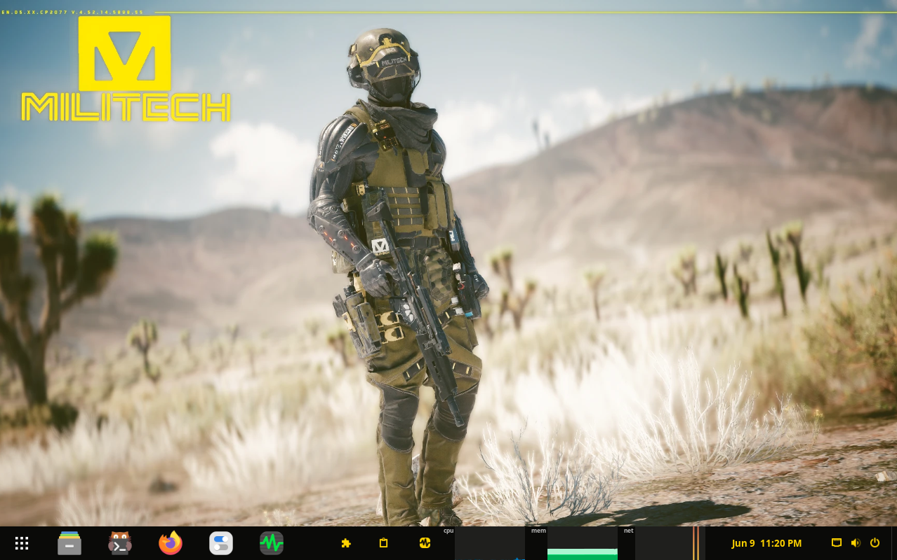
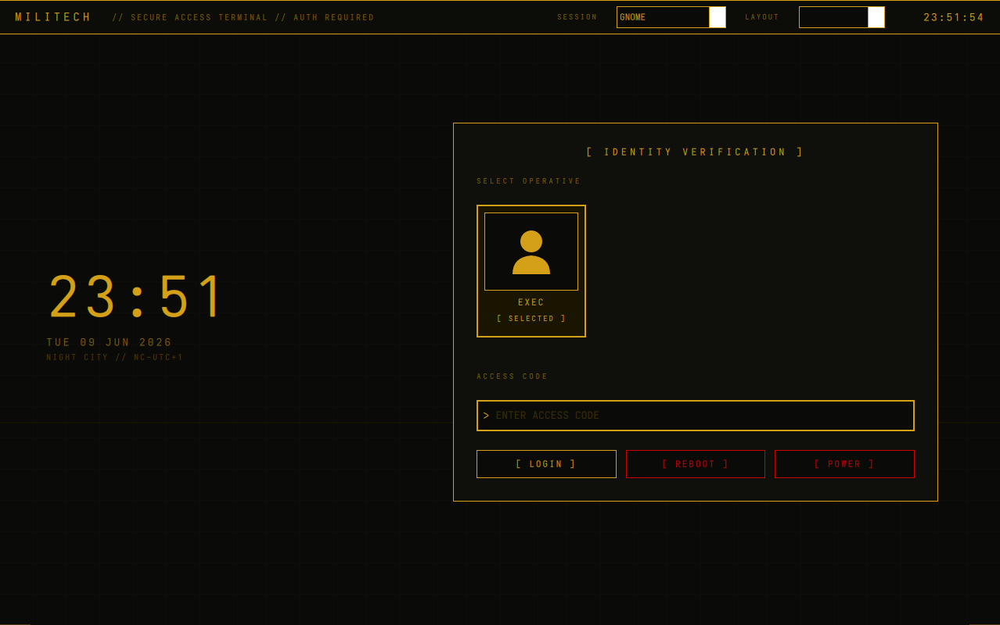
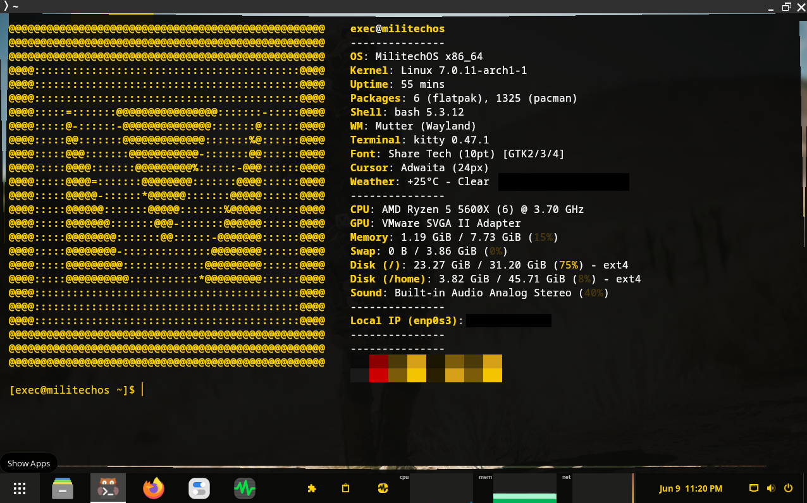
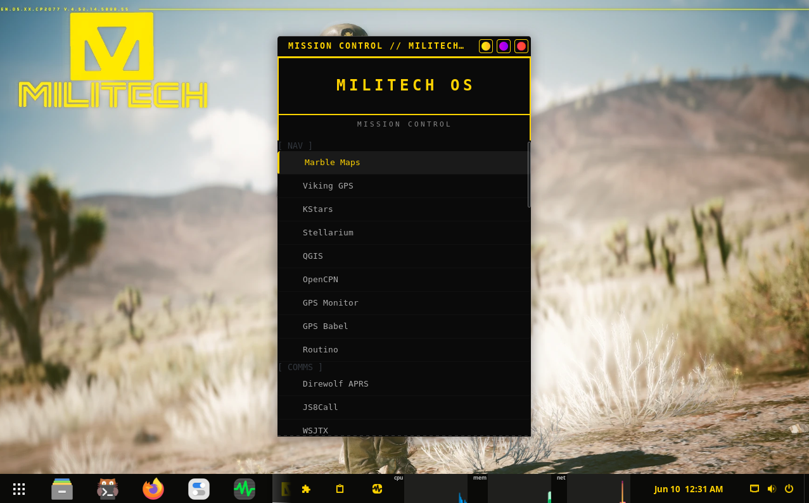

# MilitechOS Dotfiles



### A Cyberpunk-inspired tactical Linux distribution

MilitechOS is a non-commercial fan project built on Arch Linux with GNOME, 
themed around the Militech corporation from the Cyberpunk universe. It is 
designed for survival, field operations, communications, navigation, and 
intelligence gathering.

This repository contains all the custom configurations, themes, scripts, and 
assets that make up the MilitechOS experience. Users can clone this repo and 
apply it manually to any existing Arch Linux + GNOME installation.

For a full automated installation see the 
[MilitechOS Installer](https://github.com/Militech-Dev/militechos-iso).

> **Operator Edition** — A full cybersecurity and penetration testing edition 
> combining tools from Kali Linux and Parrot OS is coming soon.

---

## Screenshots

| Desktop | Login Screen |
|---------|-------------|
|  |  |

| Terminal | Mission Control |
|---------|----------------|
|  |  |

---

## Features

### Custom SDDM Login Screen
A fully custom tactical login screen built in QML featuring:
- Militech gold and black color scheme
- Animated scan line background with corner decorations
- Large clock and date display
- User card selection with identity verification UI
- Session selector for GNOME Wayland
- Animated panel border glow
- Custom Share Tech Mono font

### Boot Animation
A custom Plymouth boot animation featuring:
- Full video animation converted to 154 PNG frames at 24fps
- Boot sound that plays when the SDDM login screen appears
- SimplesDRM renderer for broad hardware compatibility
- Automatic KMS detection for correct GPU driver loading

### Mission Control App Launcher
A custom GTK3 application launcher (Super+M) featuring:
- Gold and black tactical UI matching the MilitechOS aesthetic
- Organized into categories: NAV, COMMS, SURVIVAL, INTEL, TOOLS, SYS
- Custom Militech logo icon
- Keyboard shortcut to open (Super+M) and close (Escape)
- Minimizable window with themed titlebar

### GNOME Gold/Black Theme
Complete GNOME theming including:
- GTK4 and GTK3 gold/black color override for all apps
- Custom GNOME Shell panel with gold text and dark background
- Share Tech Mono font throughout the UI
- Papirus Dark icon theme
- Materia Dark GTK base theme

### Kitty Terminal
Custom Kitty terminal configuration:
- Share Tech Mono font
- Gold text on pure black background
- Gold cursor
- Subtle transparency
- No audio bell

### Fastfetch System Info
Custom fastfetch configuration showing:
- Militech ASCII art logo in gold
- OS, Kernel, Uptime, Packages
- Shell, WM, Terminal, Font, Cursor
- Weather, CPU, GPU, Memory, Swap, Disk
- Sound, Local IP, WiFi, Battery, Power Adapter

### Custom Bash Prompt
- Militech gold prompt color (`#FFD300`)
- Shows username, hostname, and current directory
- Fastfetch runs automatically on terminal open
- Tor Browser alias for Wayland compatibility

---

## What's Included

| File | Description |
|------|-------------|
| `bashrc.txt` | Custom bash prompt with Militech gold coloring and fastfetch on login |
| `kitty.conf` | Kitty terminal — gold on black theme with Share Tech Mono font |
| `mission-menu.py` | Mission Control GTK app launcher — open with Super+M |
| `militech-mission.desktop` | Desktop entry file for Mission Control with Militech icon |
| `fastfetch-config.jsonc` | Fastfetch system info config with all modules |
| `militech.txt` | Militech ASCII art logo for fastfetch |
| `gtk4.css` | GTK4 gold/black color override for all GNOME apps |
| `gtk3.css` | GTK3 gold/black color override |
| `gnome-shell.css` | GNOME Shell panel gold theme |
| `sddm-Main.qml` | Custom SDDM login screen — tactical identity verification UI |
| `sddm-metadata.desktop` | SDDM theme metadata and QtVersion declaration |
| `ShareTechMono-Regular.ttf` | Share Tech Mono font used throughout the UI |
| `plymouth-script.txt` | Plymouth boot animation script — plays PNG frames on boot |
| `plymouth-theme.txt` | Plymouth theme config |
| `militech-boot.ogg` | Boot sound — plays when SDDM login screen appears |
| `plymouth-frames.zip` | Boot animation PNG frame sequence (154 frames at 24fps) |
| `militech-sound.service` | Systemd service that triggers boot sound at SDDM startup |
| `mkinitcpio.conf` | Initramfs config with Plymouth and KMS hooks |
| `kernel-cmdline.txt` | Kernel command line — quiet splash for clean boot |
| `plymouthd.conf` | Plymouth daemon config with SimplesDRM for broad hardware support |
| `grub-default` | GRUB bootloader configuration |
| `sddm.conf` | SDDM display manager config pointing to militech theme |
| `os-release` | MilitechOS branding — replaces Arch Linux references |
| `packages.txt` | Full package list for Survival Edition |
| `gnome-extensions.txt` | List of installed GNOME extensions |
| `wallpaper.webp` | Default desktop wallpaper |

---

## GNOME Extensions

| Extension | Purpose |
|-----------|---------|
| Dash to Panel | Combines top bar and dock into single taskbar |
| User Themes | Allows custom GNOME Shell themes |
| Burn My Windows | Window open/close animations |
| Clipboard History | Clipboard manager |
| System Monitor Next | CPU/RAM/Network usage in taskbar |
| Desktop Cube | Workspace cube switching animation |
| Drive Menu | Removable drives quick access in taskbar |
| Extension List | Manage extensions from taskbar |
| Happy Appy Hotkey | Custom keyboard shortcuts for apps |
| Espresso | Prevent screen from sleeping |

---

## System Requirements

### Survival Edition

| Component | Minimum | Recommended |
|-----------|---------|-------------|
| RAM | 4GB | 8GB |
| Storage | 40GB | 60GB |
| CPU | x86_64 dual core 2GHz | x86_64 quad core |
| GPU | Any with KMS/DRM support | AMD or Intel |
| Boot | UEFI | UEFI |
| Architecture | x86_64 | x86_64 |

### Operator Edition — Coming Soon

> The Operator Edition combines tools from Kali Linux and Parrot OS into a 
> single superior cybersecurity suite on top of the full Survival Edition.
> System requirements will be published on release.

---

## Manual Installation

> For a full automated installation use the 
> [MilitechOS Installer](https://github.com/Militech-Dev/militechos-iso)

**1. Install dependencies:**
```bash
sudo pacman -S gnome sddm kitty fastfetch python-gobject gtk3 plymouth
yay -S python-gi
```

**2. Clone this repo:**
```bash
git clone https://github.com/Militech-Dev/militechos-dots.git
cd militechos-dots
```

**3. Apply user configs:**
```bash
cp bashrc.txt ~/.bashrc
mkdir -p ~/.config/kitty && cp kitty.conf ~/.config/kitty/kitty.conf
mkdir -p ~/.config/militechos
cp mission-menu.py ~/.config/militechos/mission-menu.py
mkdir -p ~/.config/fastfetch
cp fastfetch-config.jsonc ~/.config/fastfetch/config.jsonc
cp militech.txt ~/.config/fastfetch/militech.txt
mkdir -p ~/.config/gtk-4.0 && cp gtk4.css ~/.config/gtk-4.0/gtk.css
mkdir -p ~/.config/gtk-3.0 && cp gtk3.css ~/.config/gtk-3.0/gtk.css
mkdir -p ~/.themes/militech/gnome-shell
cp gnome-shell.css ~/.themes/militech/gnome-shell/gnome-shell.css
```

**4. Install SDDM theme:**
```bash
sudo mkdir -p /usr/share/sddm/themes/militech/assets
sudo cp sddm-Main.qml /usr/share/sddm/themes/militech/Main.qml
sudo cp sddm-metadata.desktop /usr/share/sddm/themes/militech/metadata.desktop
sudo cp ShareTechMono-Regular.ttf /usr/share/sddm/themes/militech/assets/
```

**5. Install Plymouth boot animation:**
```bash
sudo mkdir -p /usr/share/plymouth/themes/militech/frames
sudo cp plymouth-script.txt /usr/share/plymouth/themes/militech/militech.script
sudo cp plymouth-theme.txt /usr/share/plymouth/themes/militech/militech.plymouth
sudo cp militech-boot.ogg /usr/share/plymouth/themes/militech/
sudo unzip plymouth-frames.zip -d /
sudo plymouth-set-default-theme -R militech
```

**6. Enable boot sound:**
```bash
sudo cp militech-sound.service /etc/systemd/system/
sudo systemctl enable militech-sound.service
```

**7. Apply system configs:**
```bash
sudo cp mkinitcpio.conf /etc/mkinitcpio.conf
sudo cp kernel-cmdline.txt /etc/kernel/cmdline
sudo cp plymouthd.conf /etc/plymouth/plymouthd.conf
sudo cp grub-default /etc/default/grub
sudo cp sddm.conf /etc/sddm.conf
sudo cp os-release /etc/os-release
sudo mkinitcpio -P
sudo grub-mkconfig -o /boot/grub/grub.cfg
```

**8. Set GNOME theme:**
```bash
gsettings set org.gnome.desktop.interface gtk-theme "Materia-dark"
gsettings set org.gnome.desktop.interface icon-theme "Papirus-Dark"
gsettings set org.gnome.desktop.interface font-name "Share Tech Mono 10"
gsettings set org.gnome.desktop.interface color-scheme "prefer-dark"
gsettings set org.gnome.shell.extensions.user-theme name "militech"
```

---

## Related Repositories

| Repository | Description |
|------------|-------------|
| [militechos-iso](https://github.com/Militech-Dev/militechos-iso) | Installer and ISO build scripts |
| [militechos-repo](https://github.com/Militech-Dev/militechos-repo) | MilitechOS package repository |

---

## License

See [LICENSE](LICENSE) for full terms.

MilitechOS code and configurations © 2026 Militech-Dev — CC BY-NC-SA 4.0

Cyberpunk universe assets © CD Projekt Red & R. Talsorian Games.
This is a non-commercial fan project with no affiliation to either company.
All third party assets remain the property of their respective owners.
